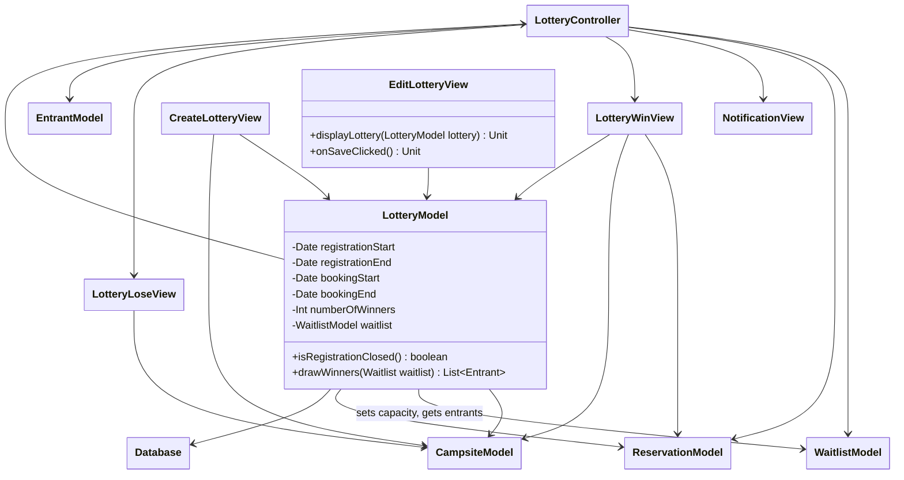

# Lottery

```mermaid
---
config:
    class:
        hideEmptyMembersBox: true
---
classDiagram

class LotteryController {
%% constructors


%% methods

}

%% collaborators
LotteryController --> WaitlistModel
LotteryController --> ReservationModel
LotteryController --> NotificationView
LotteryController --> LotteryWinView
LotteryController --> LotteryLoseView
LotteryController --> EntrantModel

class LotteryLoseView {
%% constructors


%% methods

}

%% collaborators
LotteryLoseView --> CampsiteModel

class LotteryWinView {

}

LotteryWinView --> ReservationModel
LotteryWinView --> CampsiteModel
LotteryWinView --> LotteryModel

class CreateLotteryView {

}
CreateLotteryView --> LotteryModel
CreateLotteryView --> CampsiteModel

class EditLotteryView {
%% display current lottery information that can be editable
+displayLottery(LotteryModel lottery) Unit

%% save button
+onSaveClicked() Unit

}
 EditLotteryView --> LotteryModel

class LotteryModel {
%% store registration period
-Date registrationStart
-Date registrationEnd

%% store booking period
-Date bookingStart
-Date bookingEnd

%% store number of lottery winners
-Int numberOfWinners
-WaitlistModel waitlist

%% constructors


%% methods
%% Optionally set a capacity for my lottery waitlist.

%% automatically draw winners after the registration period ends.
+isRegistrationClosed() boolean
+drawWinners(Waitlist waitlist) List~Entrant~

%% Updates lotterylist

}

LotteryModel --> CampsiteModel
LotteryModel --> WaitlistModel : sets capacity, gets entrants
LotteryModel --> ReservationModel
LotteryModel --> LotteryController
LotteryModel --> Database

```