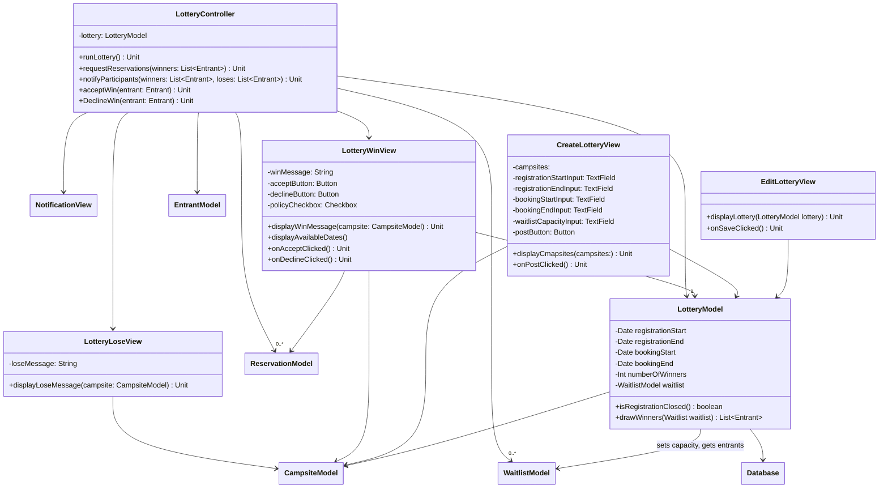

```mermaid
---
config:
    class:
        hideEmptyMembersBox: true
---
classDiagram

class LotteryController {
    -lottery: LotteryModel

    %% --- constructors ---


    %% --- methods ---
    %% call draw
    +runLottery() Unit

    %% ask ReservationModel to create reservation for winners
    +requestReservations(winners: List~Entrant~) Unit

    %% ask notifications to send win and lose messages
    +notifyParticipants(winners: List~Entrant~, loses: List~Entrant~) Unit

    %% manages when winning entrants accepts or declines reservation
    +acceptWin(entrant: Entrant) Unit
    +DeclineWin(entrant: Entrant) Unit
}

%% collaborators
LotteryController --> "1" LotteryModel
LotteryController --> "0..*" WaitlistModel
LotteryController --> "0..*" ReservationModel
LotteryController --> NotificationView
LotteryController --> LotteryWinView
LotteryController --> LotteryLoseView
LotteryController --> EntrantModel

class LotteryLoseView {
    %% display lose message with campsite name
    -loseMessage: String

    %% --- constructors ---


    %% --- methods ---
    +displayLoseMessage(campsite: CampsiteModel) Unit

}

%% collaborators
LotteryLoseView --> CampsiteModel

class LotteryWinView {
    %% display win message with campsite name
    -winMessage: String

    
    %% Button to accept reservation
    -acceptButton: Button
    %% Button to decline reservation
    -declineButton: Button

    %% Checkbox for entrants to confirm that they have read the campsite rules and policies before confirming their reservation
    -policyCheckbox: Checkbox

    %% --- methods ---
    +displayWinMessage(campsite: CampsiteModel) Unit

    %% Display available dates of the campsite that can be reserved for
    +displayAvailableDates()
    +onAcceptClicked() Unit
    +onDeclineClicked() Unit
}

LotteryWinView --> ReservationModel
LotteryWinView --> CampsiteModel
LotteryWinView --> LotteryModel

class CreateLotteryView {
    %% list multiple campsites in a lottery for a certain period.
    -campsites: 

    %% textbox to set registration period
    -registrationStartInput: TextField
    -registrationEndInput: TextField

    %% textbox to set booking period
    -bookingStartInput: TextField
    -bookingEndInput: TextField

    %% textbox to set number of lottery winners
    -waitlistCapacityInput: TextField

    %% textbox to optionally set a capacity for my lottery waitlist.

    %% button to post lottery
    -postButton: Button

    %% --- methods ---
    +displayCmapsites(campsites: ) Unit
    +onPostClicked() Unit

}

CreateLotteryView --> LotteryModel
CreateLotteryView --> CampsiteModel

class EditLotteryView {
    %% display current lottery information that can be editable


    %% --- methods ---
    +displayLottery(LotteryModel lottery) Unit
    %% save button
    +onSaveClicked() Unit

}
 EditLotteryView --> LotteryModel

class LotteryModel {
    %% store registration period
    -Date registrationStart
    -Date registrationEnd

    %% store booking period
    -Date bookingStart
    -Date bookingEnd

    %% store number of lottery winners
    -Int numberOfWinners
    -WaitlistModel waitlist

    %% --- constructors ---


    %% --- methods ---
    %% Optionally set a capacity for my lottery waitlist.

    %% automatically draw winners after the registration period ends.
    +isRegistrationClosed() boolean
    +drawWinners(Waitlist waitlist) List~Entrant~

    %% Updates lotterylist

}

LotteryModel --> CampsiteModel
LotteryModel --> WaitlistModel : sets capacity, gets entrants
LotteryModel --> Database

```